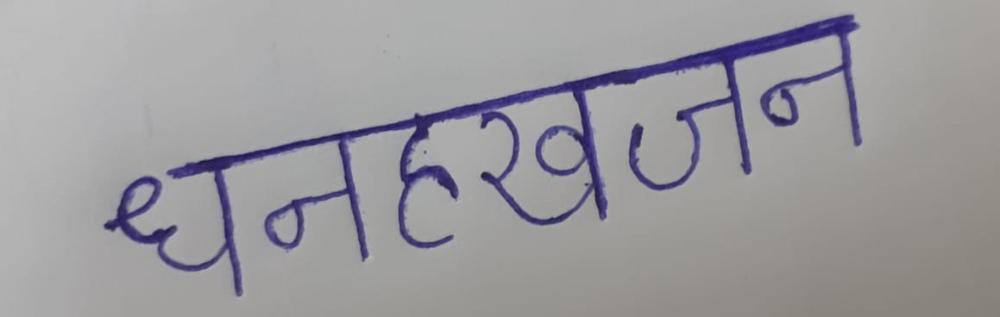
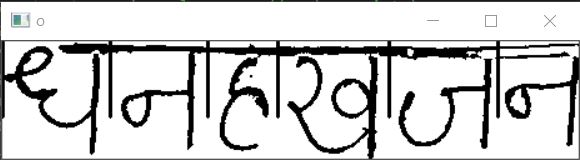
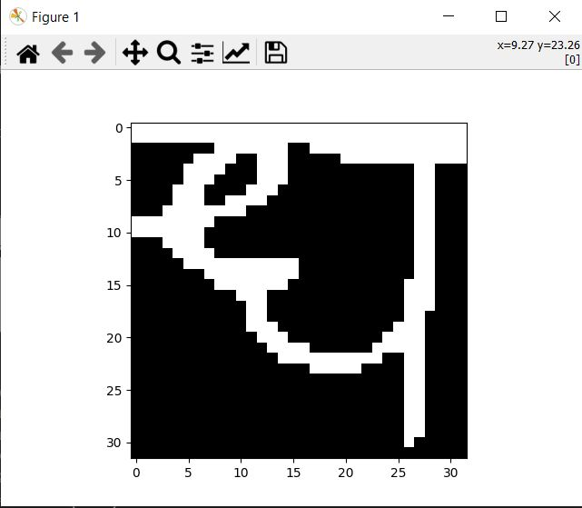
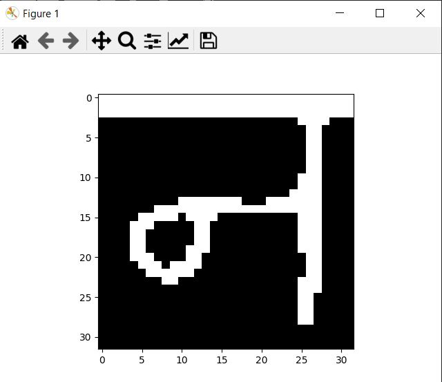
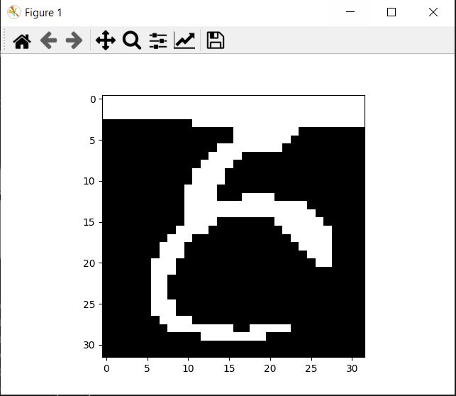
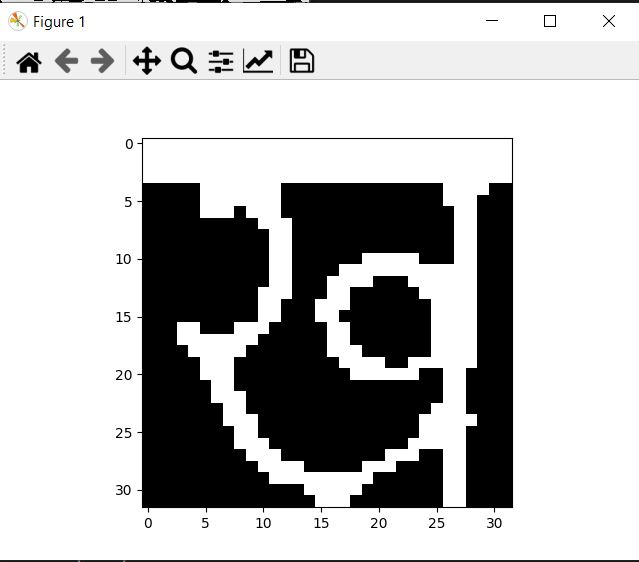
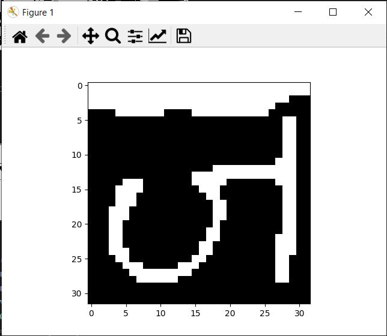
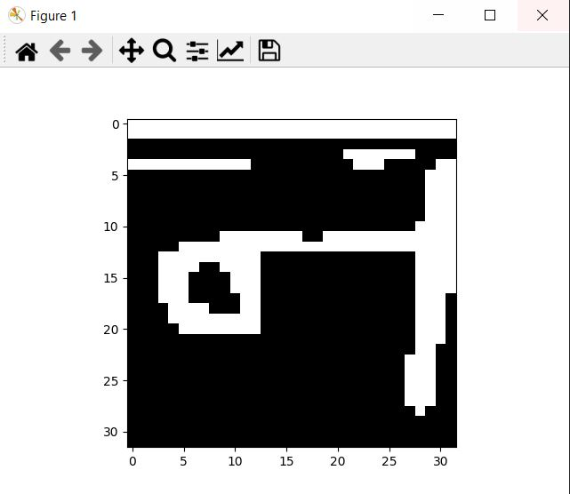
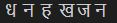

# Handwritten Hindi Character Recognition

This is a simple implementation of Handwritten Hindi Character Recognition using CNN model trained using Tensorflow and Keras libraries.

Image preprocessing and segmentation is solely done using OpenCV for most of the hindi words model give proper prediction.

- For training the model I have used Devanagari Character Set from Kaggle [click here](https://www.kaggle.com/rishianand/devanagari-character-set)

## Our approach for Hindi character segmentation
### Steps
- Removing shadows and noises from the image.
- Deskewing the hindi word written in image.
- Using horizontal projection of image we remove the unncesseary area above and below the hindi word.
- Using vertical projection we remove the unnecessary area in the left and write of hindi word.
- Again taking vertical projection of image we segment the characters because the 'SHIROREKHA' will have the smallest sum of pixels in vertical projection.
- After segmentation of each character we send it to our model to predict the character.

<sharp> Note : We have used two CNN models for char recognition for better accuracy.</sharp>

## Working demo
### Orginal Image

### Processed Image

### Segmentated Characters

### Images Pushed into model for prediction

### Final Prediction returned by models

## Possible Improvements
- One can improve the image preprocessing such that it became more robust.
- For segmentation some backtracking methods can be used to be able to segment not connected hindi char such as "ga" and "sha".
- Model can be trained for hindi matra which can also segmented using our approach.
- Model can also be trained to consider complete word inspite of using character for prediction.

 
